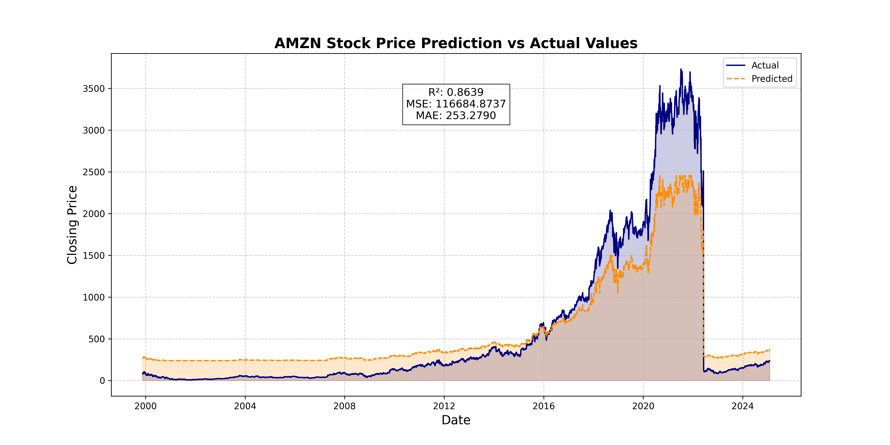

# AMZN Stock Forecasting with Docker, Airflow, PostgreSQL, and HGBR

## 📌 Project Overview
This project automates stock price prediction for **Amazon (AMZN)** using **Apache Airflow**, **Docker**, **PostgreSQL**, and **HistGradientBoostingRegressor (HGBR)**. The pipeline:
- Retrieves stock data from the **Alpha Vantage API**.
- Stores and manages all data in **PostgreSQL**.
- Computes **technical indicators** (SMA, RSI, volatility, OBV).
- Trains an ML model with **HGBR and hyperparameter tuning**.
- Predicts stock prices and evaluates model performance.
- Generates a **visual comparison** of actual vs. predicted prices with key metrics (**R², MSE, MAE**).

The workflow is fully **containerized using Docker**, ensuring **scalability, reproducibility, and easy deployment**.

---

## 📌 Data Source: Alpha Vantage API
The pipeline fetches **daily stock price data** from [Alpha Vantage API](https://www.alphavantage.co/documentation/) using the `TIME_SERIES_DAILY` function.

### **Example API Request**
```bash
https://www.alphavantage.co/query?function=TIME_SERIES_DAILY&symbol=AMZN&apikey=YOUR_API_KEY&outputsize=full&datatype=json
```
**Extracted Features:**
- **Market data:** `open`, `high`, `low`, `close`, `volume`
- **Computed indicators:** `SMA (7 & 14 days)`, `volatility`, `RSI`, `OBV`

To use the API, obtain a **free API key** from [Alpha Vantage](https://www.alphavantage.co/support/#api-key).

---

## 📌 Project Structure
```
├── dags/                          # Airflow DAGs
│   ├── amzn_forecast_pipeline.py  # DAG definition
├── logs/                          # Airflow logs
├── models/                        # Trained ML models
│   ├── amzn_model.pkl             # Saved model
├── plots/                         # Visualization output
│   ├── amzn_predictions.png       # Actual vs. predicted prices
├── scripts/                       # Python scripts
│   ├── extract_data.py            # Fetches AMZN stock data from API
│   ├── preprocess_data.py         # Processes stock data and computes indicators
│   ├── train_model.py             # Trains HGBR model and stores metrics
│   ├── predict.py                 # Generates predictions using the model
│   ├── visualize_predictions.py   # Plots results and saves visualization
│   ├── init_db.sql                # SQL script to initialize database schema
├── docker-compose.yaml            # Docker setup
├── requirements.txt               # Dependencies
├── airflow.cfg                    # Airflow configuration file
├── README.md                      # Documentation
```

---

## 📌 Pipeline Workflow
This **end-to-end ML pipeline** runs in **Apache Airflow** and stores all data in **PostgreSQL**:

1️⃣ **Extract Data** → Fetch AMZN stock data from API and store it in PostgreSQL (`extract_data.py`).  
2️⃣ **Preprocess Data** → Clean data, compute indicators, and update the database (`preprocess_data.py`).  
3️⃣ **Train Model** → Train HGBR with hyperparameter tuning and store metrics (`train_model.py`).  
4️⃣ **Make Predictions** → Predict stock prices and store results (`predict.py`).  
5️⃣ **Visualize Results** → Generate plots and save them in `plots/` (`visualize_predictions.py`).  

### **Airflow DAG execution order**
```bash
extract_data >> preprocess_data >> train_model >> predict >> visualize_predictions
```

---

## 📌 PostgreSQL Database Schema
All data is **stored and managed in PostgreSQL**.

### **Database Tables**
| Table Name      | Description                                   |
|----------------|-----------------------------------------------|
| `stock_data`   | Raw stock data fetched from Alpha Vantage API |
| `processed_data` | Preprocessed data with computed indicators  |
| `predictions`  | Model predictions and actual stock prices    |
| `model_metrics` | Model performance metrics (R², MSE, MAE)    |

The database is **automatically created** inside the PostgreSQL container when Airflow runs the pipeline.


---

## 📌 Setup and Execution Guide

### 1️⃣ Clone the Repository
To get started, clone the repository:

```bash
git clone https://github.com/FranRguezCer/amzn-stocks-predictions-airflow.git
cd amzn-stocks-predictions-airflow
```

### 2️⃣ Set Up Docker and Airflow
Ensure **Docker** and **Docker Compose** are installed. Then, start all services, including Airflow and PostgreSQL:

```bash
docker-compose up -d # (Start all containers in detached mode)
```

### 3️⃣ Initialize the Database
Before running the DAG, execute the SQL script to set up the database schema:

```bash
docker exec -it airflow_postgres psql -U airflow -d airflow -f /opt/airflow/scripts/init_db.sql
```

### 4️⃣ Access Airflow Web UI
Once running, open your browser and go to:

```bash
http://localhost:8080
```

- **DAG Name:** `amzn_forecast_pipeline`
- Enable the DAG and trigger a **manual run**.

### 5️⃣ View Results
Once the DAG completes execution:
- **Predictions Table:** Stored in PostgreSQL (`predictions` table).
- **Model Metrics Table:** Stored in PostgreSQL (`model_metrics` table).
- **Visualization Output:** Saved as an image in `plots/amzn_predictions.png`.

---

## 📌 Model Performance Evaluation
Evaluated on **20% test data**, key metrics include:
- **R² Score**: Accuracy of predictions.
- **MSE (Mean Squared Error)**: Error magnitude.
- **MAE (Mean Absolute Error)**: Average deviation.

Metrics are **displayed on the visualization**, centered at the top.

---

## 📌 Dependency Management with Docker
You **do not need to install dependencies manually**. Docker Compose installs them inside the container and also initializes the PostgreSQL database schema automatically.

### 🛠 Database Initialization on Startup
The `init_db.sql` script is executed automatically when the **PostgreSQL container** starts, ensuring that all necessary tables are created before running the pipeline.

```yaml
airflow_postgres:
  image: postgres:13
  container_name: airflow_postgres
  restart: always
  environment:
    POSTGRES_USER: airflow
    POSTGRES_PASSWORD: airflow
    POSTGRES_DB: airflow
  volumes:
    - ./scripts/init_db.sql:/docker-entrypoint-initdb.d/init_db.sql
  ports:
    - "5432:5432"
```

### 🛠 Worker Dependency Management
Airflow Worker automatically installs all required Python dependencies before executing tasks. This ensures that all scripts have access to necessary libraries without manual intervention.

```yaml
airflow_worker:
  container_name: airflow_worker
  <<: *airflow-common
  command: celery worker
  restart: always
  depends_on:
    airflow_init:
      condition: service_completed_successfully
  entrypoint: >
    sh -c "pip install -r /opt/airflow/requirements.txt && exec airflow celery worker"
```

### 🔹 This configuration:
- **Installs all Python dependencies** listed in `requirements.txt` inside the container.
- **Ensures Airflow starts correctly** with all necessary packages.
- **Prevents compatibility issues** by keeping dependencies isolated within Docker.

### ❌ No Need for Manual Installation
Do **not** run:
```bash
pip install -r requirements.txt
```
This is already handled inside the Docker container.

Additionally, there is **no need to manually create database tables**. The initialization script (`init_db.sql`) is executed automatically when the **PostgreSQL** service starts.

---

### ⚠️ When to Install Manually?
Only if:
- Running scripts **outside Docker**.
- Adding a new library **without restarting containers**.
- Manually modifying or resetting the **PostgreSQL** database schema.

Manual install:
```bash
pip install -r requirements.txt
```

To manually reset the database schema:
```bash
docker exec -it airflow_postgres psql -U airflow -d airflow -f /opt/airflow/scripts/init_db.sql
```

---

### 🚀 Conclusion
With Docker Compose, dependencies and database initialization are fully managed **inside the container**. To start the project:
```bash
docker-compose up -d
```

This will:
✔ Install all required **Python dependencies**.  
✔ Ensure **Airflow services** start correctly.  
✔ Automatically **create and initialize** the **PostgreSQL** database schema.

🔹 **Your Airflow pipeline is fully functional inside the Docker environment!** 🚀

---

## 📌 Example Visualization Output
The pipeline generates a **comparison plot**:



Metrics **(R², MSE, MAE)** are displayed at the top.

---

## 📌 Future Improvements
🚀 **Next steps:**
- Optimize hyperparameters using **Bayesian Search**.
- Add more **market indicators** (e.g., Bollinger Bands).
- Implement **LSTM/Transformer models** for better forecasting.

---

## 📌 License
This project is open-source under the **MIT License**.

---

**Author:** Francisco José Rodríguez Cerezo  
📧 Contact: [portfolio.fjrguezcer@gmail.com](mailto:portfolio.fjrguezcer@gmail.com)  
👉 GitHub: [FranRguezCer](https://github.com/FranRguezCer/)
